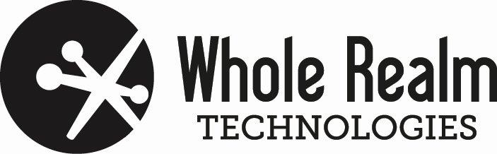

# perriera/VoxTag2
This is a Dart/Flutter re-implementation of the Apple Swift based VoxTag project. Whereas the original VoxTag project only targeted the iPhone platform, this re-implementation the features of VoxTag supports both iPhone and the Android platforms.  The VoxTag project itself is a means by which to allow the end user to quickly tag photos, organize photos by multiple tags and retrieve photos from a mobile device using voice. As VoiceTag was not available,  (already in use) the name was changed to VoxTag. Also, the original VoxTag had to make duplicates of all photos stored on the device whereas the new VoxTag2 accesses the Photos inside the Photos directly, (pending permissions being granted).  

### PATENT PENDING 
This project has been developed in conjunction with seed investment from [WholeRealm Technologies](https://www.wholerealm.com/).
## Programmers Guide
Anyone wishing to compile the source code will first have to become acquainted with the Dart/Flutter environment. 
This course is strongly recommended: [The Complete 2021 Flutter Development Bootcamp with Dart](https://www.udemy.com/course/flutter-bootcamp-with-dart/#overview)

Short of doing the Udemy.com course:
This project is a starting point for a Flutter application.

A few resources to get you started if this is your first Flutter project:

- [Lab: Write your first Flutter app](https://flutter.dev/docs/get-started/codelab)
- [Cookbook: Useful Flutter samples](https://flutter.dev/docs/cookbook)

For help getting started with Flutter, view our
[online documentation](https://flutter.dev/docs), which offers tutorials,
samples, guidance on mobile development, and a full API reference.

# voxtag2app

](https://github.com/mattcoding4days/extras/actions/workflows/cmake.yml)

  
   

## Who would want to use this?
This code is intended for the VoxTag/VoxTag2 project as coordinated between EXPARX, WholeRealm and RGI Technologies.

>
> Presently intended for iPhone and Android platforms only.
>

## Visual Studio Code (build/ directory) Compilation Fail Safe
The industry practice of compiling to a build/ directory is supported here. When you detect some funny business going on with your development environment, (for example if the cmake utility keeps rebuilding everything), merely delete the build/ directory, (aka. `rm -rf build`) and recreate it. If you are using the Visual Studio Code environment you can press **SHIFT-CTRL-B**, (see `.vscode/tasks.conf`) which will force a rebuild of the directory, (including re-creating `build/` for you).

> Please note: At present whenever you re-open your project with Visual Studio Code the cmake utility may or may not be in sync with the projects, (you'll notice this when all the source files keep getting rebuilt). To correct this open a Terminal window **inside** the Visual Studio Code environment and delete the build/ directory, (aka. `rm -rf build`)then rebuild the project with **SHIFT-CTRL-B**.
